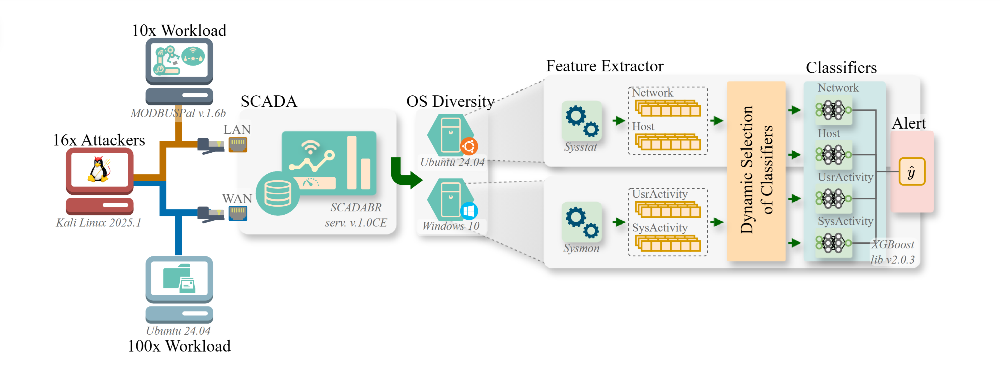

# SCADA-MV-IDS Dataset

[](https://creativecommons.org/licenses/by/4.0/)
[](#)

## Overview
The **SCADA-MV-IDS** dataset was built to support research on **machine-learning-based Intrusion Detection Systems (IDS)** in **Industrial Control Systems (ICS)**, with a focus on **SCADA** environments.  
It is **multi-view by design**, providing four heterogeneous views — **Linux Network**, **Linux Host**, **Windows User Activity**, and **Windows System Activity** — enabling studies that leverage diversity.

## Testbed Architecture
The dataset was collected using a dedicated SCADA testbed integrating Linux and Windows environments, multiple workloads, and 16 different attack scenarios.



## Key Features

- **Domain:** SCADA-based Industrial Control Systems (ICS)
- **Total Packets:** ≈ 6 billion
- **Events:** Both *normal* and *malicious* 46k (from ≈6B raw packets)
- **Attacks:** 16 distinct SCADA-related attack behaviors
- **Views:** 4 heterogeneous data views  
  - **Linux Network** — network-level traffic statistics  
  - **Linux Host** — system-level resource utilization  
  - **Windows User Activity** — process and registry operations  
  - **Windows System Activity** — kernel-level and system operations  
- **Format:** Tabular CSV (events × features)

## Dataset Organization

The dataset is structured into four main views:

| View                     | Description                           | #Features | Collection Tool |
| ----------------------- | ------------------------------------- | ---------- | --------------- |
| **Linux Network**       | Network-level traffic statistics     | 8  | Sysstat |
| **Linux Host**          | Host-level system metrics            | 17 | Sysstat |
| **Windows User Activity** | User-level process and registry activity | 10 | Sysmon |
| **Windows System Activity** | System-level monitoring for OS events | 12 | Sysmon |

## Attack Scenarios

The dataset includes **16 SCADA-related attack behaviors**.

For the full list of attack names and mappings, see:
- [attacks_mapping.md](./docs/attacks_mapping.md)
- [features_mapping.md](./docs/features_mapping.md)
- [labels_mapping.md](./docs/labels_mapping.md)

## Citation

If you use **SCADA-MV-IDS** in your research, please cite our paper:

```bibtex
@article{Espindola2025SCADAMVIDS,
  author    = {Allan Espindola and Antonio Casimiro and Altair Santin and Pedro Ferreira and Eduardo Viegas},
  title     = {Enhancing Intrusion Detection Generalization via Diversity-Driven Multi-View Ensemble Learning in Industrial Systems},
  journal   = {Elsevier Journal of Future Generation Computer Systems},
  year      = {2025},
  publisher = {IEEE},
  doi       = {10.XXXX/FGCS.XXXXXXX}
}
```
For the implementation and experiments used in the paper, see the [code repository](https://github.com/espindolaallan/dime-ids).

**Note:** The final reference, including DOI and page numbers, will be updated here once the paper is published.


## License

This dataset is released under the **Creative Commons Attribution 4.0 International (CC BY 4.0)** license.  
You are free to use, share, and adapt the dataset, provided you give proper attribution.

---

**Maintainer:** [Allan Espindola](https://github.com/espindolaallan)
